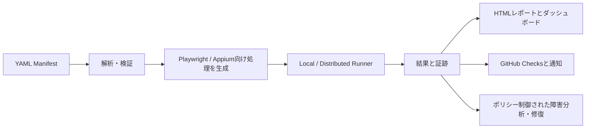

# OpenTestPilot

<p align="center">
  <strong>テストを一度定義すれば、ブラウザ・モバイル端末・Runner・GitHubワークフローで実行し、チームで確認できる証跡まで残せます。</strong>
</p>

<p align="center">
  <a href="README.md">English</a> · <a href="README.ja.md">日本語</a>
</p>

<p align="center">
  <a href="https://github.com/yuga-hashimoto/open-test-pilot/actions/workflows/ci.yml"></a>
  <a href="LICENSE"></a>
  
  
</p>


## OpenTestPilotとは？

OpenTestPilotは、AIネイティブなオープンソースのテスト自動化コントロールプレーンです。構造化されたYAML Manifestでテストを記述すると、内容を検証して標準的なテストコードを生成し、ローカルまたはRunnerで実行します。実行後はレポート、スクリーンショット、DOM・アクセシビリティスナップショット、ネットワーク証跡、ログをまとめて保存できます。

ブラウザ実行には[Playwright](https://playwright.dev/)、モバイル実行には[Appium](https://appium.io/)など、実績のあるエンジンを利用します。OpenTestPilotは、その周辺に必要な共通Manifest、再現可能なコード生成、証跡、スケジュール、GitHub連携、テナントを分離したチーム運用、ポリシーで制御されたAI障害分析・修復を一つにまとめます。

## OpenTestPilotを使う理由

テスト自動化は、スクリプト、CI設定、端末セットアップ手順、スクリーンショット、単発の修復プロンプトに分散しがちです。OpenTestPilotは、それらを一つの流れとして管理します。

- **読みやすい正本:** テストはダッシュボード内だけに閉じず、レビュー可能なYAML Manifestとして管理します。
- **隠さないコード生成:** Webテストは、確認・保存できる標準的なPlaywright TypeScriptになります。
- **Webとモバイルで共通の境界:** ブラウザ実行とAppiumベースのAndroid/iOS実行を、同じManifest・結果モデルで扱います。
- **証跡を標準保存:** 赤いステータスだけでなく、失敗理由を調べるための情報を残せます。
- **ローカルから始めてチームへ拡張:** リポジトリ内のCLIから始め、必要に応じてAPI、ダッシュボード、Runner、Scheduler、ストレージ、GitHub Appを追加できます。
- **ガードレール付きAI:** 修復処理は構造化された要求を使い、テストを不正に弱める変更を拒否し、公開前に明示的なポリシーを要求します。
- **外部テレメトリは初期状態で無効:** 監視データの送信先は運用者が選択します。

## 主な機能

| 領域 | 提供するもの |
| --- | --- |
| Manifest | バージョン付きYAMLスキーマ、解析、検証、移行、ループ、再試行、並列アクション、クリーンアップ、権限、Artifactポリシー |
| コード生成 | Manifestのアクションへ戻れるソースマップ付きの決定的なPlaywright TypeScript生成 |
| 実行 | Local Runner、分散Runnerプロトコル、Docker分離、キュー、キャンセル、並行実行、期限切れLeaseの再割り当て |
| 証跡 | HTML/JSONレポート、スクリーンショット、DOM・アクセシビリティスナップショット、ネットワークログ、生成コード、Runnerログ |
| コントロールプレーン | Reactダッシュボード、テナント単位のAPI、プロジェクト、テスト、実行履歴、Runner、スケジュール、Secretメタデータ、監査記録 |
| 連携 | GitHub OAuth/App、ブランチ、比較、Draft PR、Checks、Commit Status、Webhook、Trigger、通知 |
| エージェント | MCPブリッジ、Claude Codeプラグイン、構造化Agent Protocol、障害分析、オプトインのセルフホストAI Worker |

## テストはYAMLで記述できます

同梱のfixtureテストは人が読みやすく、Gitで管理できます。

```yaml
schemaVersion: "1.0.0"
id: fixture-login
name: Fixture login
type: e2e

steps:
  - id: login
    description: Sign in
    actions:
      - id: open-login
        type: web.goto
        url: http://127.0.0.1:4173/login
      - id: fill-email
        type: web.fill
        selector: "label=メールアドレス"
        value: test@example.com
      - id: submit-login
        type: web.click
        selector: "role=button[name=ログイン]"
      - id: assert-dashboard
        type: web.expectVisible
        selector: "[data-testid=dashboard]"

artifacts:
  screenshots: after
runner:
  minBrowsers: [chromium]
```


完全な例は[`examples/manifests/fixture-login.yaml`](examples/manifests/fixture-login.yaml)、言語仕様は[Manifest DSL仕様](docs/MANIFEST_DSL_SPEC.md)を参照してください。

## クイックスタート：実ブラウザテストをローカル実行する

### 必要なもの

- Node.js 20以上
- pnpm 10（このリポジトリではpnpm 10.28.2を固定）
- Playwright Chromium

リポジトリを取得して依存関係をインストールします。

```bash
git clone https://github.com/yuga-hashimoto/open-test-pilot.git
cd open-test-pilot
pnpm install
pnpm exec playwright install chromium
```

ターミナル1で、同梱のfixtureアプリを起動します。

```bash
node examples/fixtures/web/server.mjs
```

fixtureは`127.0.0.1:4173`だけで待ち受けます。ターミナル2でManifestの検証、コード生成、実行を行います。

```bash
pnpm testpilot manifest validate examples/manifests/fixture-login.yaml
pnpm testpilot manifest generate examples/manifests/fixture-login.yaml
pnpm testpilot run examples/manifests/fixture-login.yaml
```

実際のChromiumセッションがログインフローを実行します。ブラウザ操作が失敗した場合、runコマンドは0以外の終了コードを返します。

## 実行後に生成されるもの

生成されたPlaywrightコードは`examples/manifests/generated/`配下、実行証跡は次の場所へ保存されます。

```text
.testpilot/runs/<run-id>/
├── report.json
├── index.html
├── generated-code/
├── screenshot/
└── logs/
```

実際のファイルは、ManifestのArtifactポリシーと実行したアクションによって変わり、フローによってはDOM・アクセシビリティスナップショットも含まれます。ローカルレポートは`index.html`で確認できます。

## Webダッシュボードとチームモード

APIや認証情報なしで、意図的に用意されたデモデータ入りのレスポンシブなダッシュボードを確認できます。

```bash
pnpm --filter @open-test-pilot/web dev --host 127.0.0.1 --port 4173
```

[http://127.0.0.1:4173](http://127.0.0.1:4173)を開いてください。画面はブラウザの言語を初期値として、日本語と英語を切り替えられます。

チームモードでは、ダッシュボードをFastify API、PostgreSQL、Redis、S3互換ストレージ、分散Runner、Schedulerへ接続します。Docker ComposeとHelmの構成は同梱されていますが、ホスト済みサービスではありません。組織ID、GitHub認証情報、ストレージ、レジストリ・クラスタへのアクセス、セッショントークン、Runnerの実行能力は運用者が用意します。[デプロイガイド](docs/DEPLOYMENT.md)と[`infra/docker/docker-compose.yml`](infra/docker/docker-compose.yml)から確認してください。

AI Workerは初期状態で無効です。利用するAgent CLI、認証情報、リポジトリアクセス、セッショントークン、修復・公開ポリシーを設定した場合だけ有効にしてください。

## 仕組み



コントロールプレーンはメタデータ、スケジュール、テナント、Artifact参照、GitHub操作、監査履歴を管理します。Runnerは分離された実行と証跡収集を担当します。詳しいパッケージ境界は[システムアーキテクチャ](docs/SYSTEM_ARCHITECTURE.md)に記載しています。

## 対応する実行環境

| 対象 | 実行経路 | 注意点 |
| --- | --- | --- |
| Chromium、Firefox、WebKit | Playwright Adapter | クイックスタートはChromiumを使用します。他のPlaywrightブラウザは必要に応じてインストールします。 |
| HTTP API | ManifestのAPI ActionとAPI Adapter | 一つのフロー内でブラウザ操作と組み合わせられます。 |
| Android | Appium + UiAutomator2 | Appium Serverと、設定済みのエミュレーターまたは実機が必要です。 |
| iOS | Appium + XCUITest / WebDriverAgent | macOS・Xcodeと、設定済みのSimulatorまたは実機が必要です。 |
| ローカルリポジトリ | CLI + Local Runner | 個人利用やCIで最も早く始められる経路です。 |
| チーム | API + Web + Distributed Runner | 運用者が永続化、キュー、ストレージ、認証情報を用意します。 |

モバイルのセットアップは[AndroidとAppium](docs/ANDROID_APPIUM.md)および[iOSとAppium](docs/IOS_APPIUM.md)を参照してください。

## 現在のプロジェクト状況

OpenTestPilotは**v0.1.0**で、現在も活発に開発中です。リポジトリには、ローカルのVertical Slice、チームAPI・ダッシュボード、Runner・Artifactアップロード、Scheduler、GitHub Adapter、Appium境界、MCP・Claude Code連携、ポリシー制御されたAI Worker、Docker Compose、Helmパッケージが含まれ、テストされています。

現時点では、このREADMEに記載したリポジトリ内のコマンドを利用してください。パッケージやコンテナイメージのRegistry公開、ホスト済みコントロールプレーンの運用、本番Secretの用意、実モバイル端末の接続は、それぞれ別のリリース・運用作業です。現在の境界は[Capability Status](docs/CAPABILITY_STATUS.md)、実際に実行したシナリオは[受け入れ証跡](docs/ACCEPTANCE_EVIDENCE.md)、実装範囲は[要件監査](docs/REQUIREMENT_AUDIT.md)で確認できます。

## リポジトリ構成

```text
apps/
  web/            Reactダッシュボード
  server/         FastifyコントロールプレーンAPI
  runner/         Distributed Runnerデーモン
  scheduler/      スケジュール監視と実行Trigger
  ai-worker/      オプトインのセルフホストAgent Worker
packages/
  cli/            testpilotコマンドラインインターフェース
  manifest-*/     スキーマ、Parser、Migration
  generator/      決定的なテストコード生成
  *-adapter/      Playwright、Appium、GitHub、API、Queue、Storageなど
  *-protocol/     Agent、Runner、Resultの契約
infra/
  docker/         コンテナイメージとDocker Compose
  helm/           Kubernetes Chart
  postgres/       データベースMigration
examples/         Manifest、fixture、Action、生成例
docs/             製品、アーキテクチャ、Protocol、Security、運用ドキュメント
```

## ドキュメント

| トピック | ドキュメント |
| --- | --- |
| 製品範囲と完全な計画 | [Master Implementation Plan](docs/MASTER_IMPLEMENTATION_PLAN.md) |
| アーキテクチャとDomain Model | [System Architecture](docs/SYSTEM_ARCHITECTURE.md) · [Domain Model](docs/DOMAIN_MODEL.md) |
| コントリビューター・AI向け案内 | [Repository Map](docs/REPO_MAP.md) · [AGENTS.md](AGENTS.md) |
| 設定と運用 | [Configuration](docs/CONFIGURATION.md) · [Deployment](docs/DEPLOYMENT.md) |
| リリース引き渡し | [Release checklist](docs/RELEASE.md) |
| Manifest言語 | [Manifest DSL Specification](docs/MANIFEST_DSL_SPEC.md) |
| HTTP・MCP API | [HTTP API](docs/HTTP_API_SPEC.md) · [MCP API](docs/MCP_API_SPEC.md) |
| Runner・Agent契約 | [Runner Protocol](docs/RUNNER_PROTOCOL.md) · [Agent Protocol](docs/AGENT_PROTOCOL.md) |
| GitHub連携 | [GitHub Integration](docs/GITHUB_INTEGRATION.md) |
| デプロイ | [Deployment](docs/DEPLOYMENT.md) |
| セキュリティ・テナント分離 | [Security Model](docs/SECURITY_MODEL.md) · [Multitenancy](docs/MULTITENANCY.md) |
| テスト戦略・証跡 | [Test Strategy](docs/TEST_STRATEGY.md) · [Acceptance Evidence](docs/ACCEPTANCE_EVIDENCE.md) |

## 開発

Pull Requestを作成する前に、標準の品質チェックを実行してください。

```bash
pnpm lint
pnpm typecheck
pnpm test
pnpm build
pnpm test:web:ui
```

追加のリリース・安全性チェックは[受け入れ証跡](docs/ACCEPTANCE_EVIDENCE.md#repeatable-gates)に記載しています。

## コントリビューションとセキュリティ

コントリビューションを歓迎します。Pull Requestを作成する前に、[CONTRIBUTING.md](CONTRIBUTING.md)と[行動規範](CODE_OF_CONDUCT.md)を確認してください。

認証情報、秘密鍵、テナントデータを公開Issueへ投稿しないでください。脆弱性の可能性を報告する場合は、[SECURITY.md](SECURITY.md)の手順に従って非公開で連絡してください。

## ライセンス

OpenTestPilotは[Apache License 2.0](LICENSE)で提供されています。
