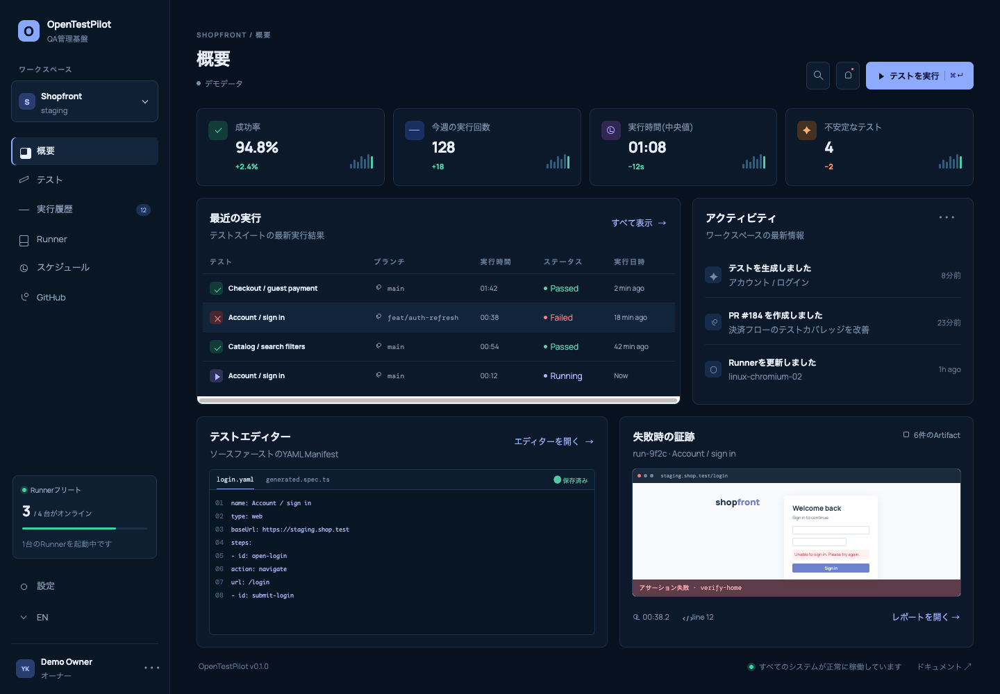
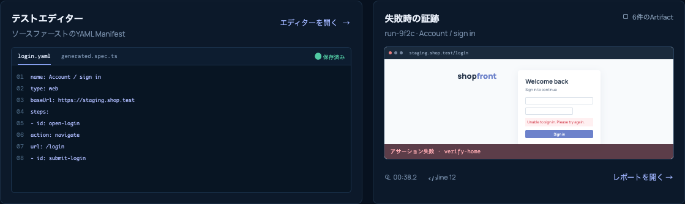
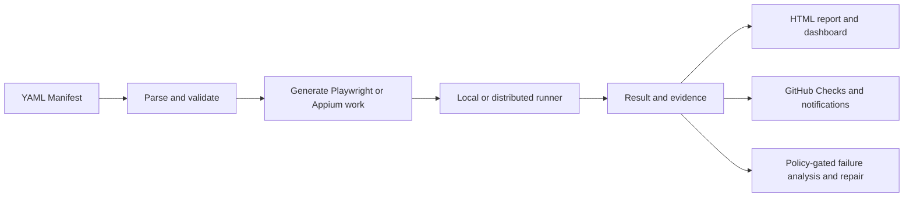

# OpenTestPilot

<p align="center">
  <strong>Define tests once. Run them across browsers, devices, runners, and GitHub workflows—with evidence your team can inspect.</strong>
</p>

<p align="center">
  <a href="README.md">English</a> · <a href="README.ja.md">日本語</a>
</p>

<p align="center">
  <a href="https://github.com/yuga-hashimoto/open-test-pilot/actions/workflows/ci.yml"></a>
  <a href="LICENSE"></a>
  
  
</p>



## What is OpenTestPilot?

OpenTestPilot is an AI-native, open-source test automation control plane. You describe a test as a structured YAML Manifest; OpenTestPilot validates it, generates standard test code, executes it locally or on runners, and collects reports, screenshots, DOM and accessibility snapshots, network evidence, and logs.

It uses proven engines such as [Playwright](https://playwright.dev/) for browsers and [Appium](https://appium.io/) for mobile devices. OpenTestPilot adds the layer around those engines: one source format, repeatable generation, evidence, scheduling, GitHub integration, tenant-safe team operation, and policy-gated AI failure analysis and repair.

## Why OpenTestPilot?

Test automation often becomes a collection of scripts, CI files, device setup notes, screenshots, and one-off repair prompts. OpenTestPilot keeps those pieces connected:

- **Readable source of truth:** tests live in reviewable YAML Manifests instead of being locked inside a dashboard.
- **Generated, not hidden:** web tests become standard Playwright TypeScript that you can inspect and keep.
- **Web and mobile boundaries:** browser execution and Appium-based Android/iOS execution use the same Manifest and result model.
- **Evidence by default:** every run can preserve the information needed to understand a failure, not just a red status.
- **Local first, team ready:** start with a repository-local CLI flow, then add the API, dashboard, runners, scheduler, storage, and GitHub App when needed.
- **AI with guardrails:** repair workflows use structured requests, reject unsafe weakening of tests, and require explicit policy before publication.
- **No external telemetry by default:** operators choose their own observability destinations.

## Core capabilities

| Area | What it provides |
| --- | --- |
| Manifest | Versioned YAML schema, parser, validation, migration, loops, retries, parallel actions, cleanup, permissions, and artifact policy |
| Generation | Deterministic Playwright TypeScript with source mapping back to Manifest actions |
| Execution | Local runner, distributed runner protocol, Docker isolation, queues, cancellation, concurrency, and lease reassignment |
| Evidence | HTML/JSON reports, screenshots, DOM and accessibility snapshots, network logs, generated source, and runner logs |
| Control plane | React dashboard, tenant-scoped API, projects, tests, runs, runners, schedules, secret metadata, and audit records |
| Integrations | GitHub OAuth/App, branches, comparisons, Draft PRs, Checks, statuses, webhooks, triggers, and notifications |
| Agents | MCP bridge, Claude Code plugin, structured agent protocol, failure analysis, and opt-in self-hosted AI Worker |

## A test is just YAML

The included fixture test is human-readable and version-control friendly:

```yaml
schemaVersion: "1.0.0"
id: fixture-login
name: Fixture login
type: e2e

steps:
  - id: login
    description: Sign in
    actions:
      - id: open-login
        type: web.goto
        url: http://127.0.0.1:4173/login
      - id: fill-email
        type: web.fill
        selector: "label=メールアドレス"
        value: test@example.com
      - id: submit-login
        type: web.click
        selector: "role=button[name=ログイン]"
      - id: assert-dashboard
        type: web.expectVisible
        selector: "[data-testid=dashboard]"

artifacts:
  screenshots: after
runner:
  minBrowsers: [chromium]
```



See the complete example in [`examples/manifests/fixture-login.yaml`](examples/manifests/fixture-login.yaml) and the full language reference in the [Manifest DSL specification](docs/MANIFEST_DSL_SPEC.md).

## Quick start: run a real browser test locally

### Requirements

- Node.js 20 or newer
- pnpm 10 (the repository pins pnpm 10.28.2)
- Playwright Chromium

Clone the repository and install dependencies:

```bash
git clone https://github.com/yuga-hashimoto/open-test-pilot.git
cd open-test-pilot
pnpm install
pnpm exec playwright install chromium
```

Start the included fixture application in terminal 1:

```bash
node examples/fixtures/web/server.mjs
```

It listens only on `127.0.0.1:4173`. In terminal 2, validate, generate, and run the Manifest:

```bash
pnpm testpilot manifest validate examples/manifests/fixture-login.yaml
pnpm testpilot manifest generate examples/manifests/fixture-login.yaml
pnpm testpilot run examples/manifests/fixture-login.yaml
```

A real Chromium session completes the login flow. The run command returns a non-zero exit code when the browser flow fails.

## What the run produces

Generated Playwright code is written below `examples/manifests/generated/`. Run evidence is stored below:

```text
.testpilot/runs/<run-id>/
├── report.json
├── index.html
├── generated-code/
├── screenshot/
└── logs/
```

The exact files depend on the Manifest's artifact policy and the actions that ran; other flows can also include DOM and accessibility snapshots. Open `index.html` to inspect the local report.

## Web dashboard and team mode

To explore the responsive dashboard with intentional demo data—no API or credentials required—run:

```bash
pnpm --filter @open-test-pilot/web dev --host 127.0.0.1 --port 4173
```

Then open [http://127.0.0.1:4173](http://127.0.0.1:4173). The interface defaults to the browser language and can be switched between Japanese and English.

Team mode connects the dashboard to the Fastify API, PostgreSQL, Redis, S3-compatible storage, distributed runners, and the scheduler. Docker Compose and Helm assets are included, but team mode is not a hosted service: organization IDs, GitHub credentials, storage, registry/cluster access, session tokens, and runner capacity are supplied by the operator. Start with the [deployment guide](docs/DEPLOYMENT.md) and [`infra/docker/docker-compose.yml`](infra/docker/docker-compose.yml).

The AI Worker is disabled by default. Enable it only after configuring the selected agent CLI, credentials, repository access, session token, and repair/publication policy.

## How it works



The control plane owns metadata, scheduling, tenancy, artifact references, GitHub operations, and audit history. Runners own isolated execution and evidence collection. Detailed package boundaries are documented in [System Architecture](docs/SYSTEM_ARCHITECTURE.md).

## Supported surfaces

| Surface | Execution path | Notes |
| --- | --- | --- |
| Chromium, Firefox, WebKit | Playwright adapter | Chromium is used by the quick start; install other Playwright browsers when needed. |
| HTTP APIs | Shared HTTP core, Fetch API-only runner, Playwright mixed-flow transport | Status/header/JSON-path/JSON-Schema assertions, extraction, redacted HTTP evidence, OpenAPI 3.x and Postman v2.1 import. Load/performance testing is intentionally separate. |
| Android | Appium + UiAutomator2 | Requires an Appium server plus a configured emulator or physical device. |
| iOS | Appium + XCUITest/WebDriverAgent | Requires macOS/Xcode plus a configured simulator or physical device. |
| Local repositories | CLI + local runner | Fastest path for individual use and CI. |
| Teams | API + web + distributed runners | Requires operator-managed persistence, queue, storage, and credentials. |

Mobile setup is documented separately in [Android with Appium](docs/ANDROID_APPIUM.md) and [iOS with Appium](docs/IOS_APPIUM.md).

### API testing

Run an API-only Manifest without launching a browser:

```bash
pnpm testpilot run examples/manifests/api-complete.yaml
```

Import a specification into a reviewable Manifest draft:

```bash
pnpm testpilot import openapi examples/fixtures/api/openapi.yaml --output /tmp/api.yaml
pnpm testpilot import postman examples/fixtures/api/postman.collection.json --output /tmp/postman.yaml
```

`source analyze --framework openapi|postman` remains heuristic discovery. The `import` commands perform structured OpenAPI 3.x/Postman v2.1 conversion and reject unresolved remote references. Functional and contract checks are supported; load, stress, soak, and VU testing are not part of the Manifest runner.

## Current project status

OpenTestPilot is at **v0.1.0** and under active development. The repository contains and tests the local vertical slice, team API/dashboard, runner and artifact upload path, scheduler, GitHub adapters, Appium boundaries, MCP/Claude Code integration, policy-gated AI Worker, Docker Compose, and Helm packaging.

Use the repository-local commands in this README. Publishing packages or images to a registry, running a hosted control plane, providing production secrets, and attaching real mobile devices remain separate release or operator steps. See [Capability Status](docs/CAPABILITY_STATUS.md) for the current boundary, [Acceptance Evidence](docs/ACCEPTANCE_EVIDENCE.md) for executed scenarios, and [Requirement Audit](docs/REQUIREMENT_AUDIT.md) for the implementation boundary.

## Repository structure

```text
apps/
  web/            React dashboard
  server/         Fastify control-plane API
  runner/         Distributed runner daemon
  scheduler/      Schedule polling and run triggers
  ai-worker/      Opt-in self-hosted agent worker
packages/
  cli/            testpilot command-line interface
  manifest-*/     Schema, parser, and migration
  generator/      Deterministic test generation
  *-adapter/      Playwright, Appium, GitHub, API, queue, storage, and more
  *-protocol/     Agent, runner, and result contracts
infra/
  docker/         Images and Docker Compose
  helm/           Kubernetes chart
  postgres/       Database migrations
examples/         Manifests, fixtures, actions, and generated examples
docs/             Product, architecture, protocol, security, and operations docs
```

## Documentation

| Topic | Document |
| --- | --- |
| Product scope and complete plan | [Master Implementation Plan](docs/MASTER_IMPLEMENTATION_PLAN.md) |
| Architecture and domain model | [System Architecture](docs/SYSTEM_ARCHITECTURE.md) · [Domain Model](docs/DOMAIN_MODEL.md) |
| Contributor and agent orientation | [Repository Map](docs/REPO_MAP.md) · [AGENTS.md](AGENTS.md) |
| Configuration and operator setup | [Configuration](docs/CONFIGURATION.md) · [Deployment](docs/DEPLOYMENT.md) |
| Release handoff | [Release checklist](docs/RELEASE.md) |
| Manifest language | [Manifest DSL Specification](docs/MANIFEST_DSL_SPEC.md) |
| HTTP and MCP APIs | [HTTP API](docs/HTTP_API_SPEC.md) · [MCP API](docs/MCP_API_SPEC.md) |
| Runner and agent contracts | [Runner Protocol](docs/RUNNER_PROTOCOL.md) · [Agent Protocol](docs/AGENT_PROTOCOL.md) |
| GitHub integration | [GitHub Integration](docs/GITHUB_INTEGRATION.md) |
| Deployment | [Deployment](docs/DEPLOYMENT.md) |
| Security and tenancy | [Security Model](docs/SECURITY_MODEL.md) · [Multitenancy](docs/MULTITENANCY.md) |
| Test strategy and evidence | [Test Strategy](docs/TEST_STRATEGY.md) · [Acceptance Evidence](docs/ACCEPTANCE_EVIDENCE.md) |

## Development

Run the standard quality gates before opening a pull request:

```bash
pnpm lint
pnpm typecheck
pnpm test
pnpm build
pnpm test:web:ui
```

Additional release and safety checks are listed in [Acceptance Evidence](docs/ACCEPTANCE_EVIDENCE.md#repeatable-gates).

## Contributing and security

Contributions are welcome. Read [CONTRIBUTING.md](CONTRIBUTING.md) and the [Code of Conduct](CODE_OF_CONDUCT.md) before opening a pull request.

Do not disclose credentials, private keys, or tenant data in public issues. Follow [SECURITY.md](SECURITY.md) to report a suspected vulnerability privately.

## License

OpenTestPilot is licensed under the [Apache License 2.0](LICENSE).
